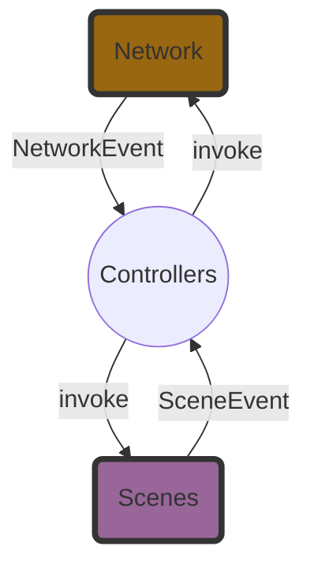

# Overview

go-holdem is a multi-player (p2p) Texas Hold'em game that runs in a terminal.

## Architecture

### Event driven model

Controller holds two channels: 

- channel Network -> Scene
- channel Scene -> Network

### Network topology

All players(peers) in a game room form a mesh-like topology.

Not all game data is broadcast by everyone:
- **Game Commands** (actions that change game state) are sequenced and delivered by the authority/leader.
- Non-game commands (chat, liveness, etc.) may be broadcast by any peer.

## Authority and consensus

There is no central server; an authority peer runs the main game logic.
- **3+ players (voting peers)**: We run Raft to elect a leader and replicate game commands in a Raft log.
- **2 players (heads-up)**: We skip Raft.

