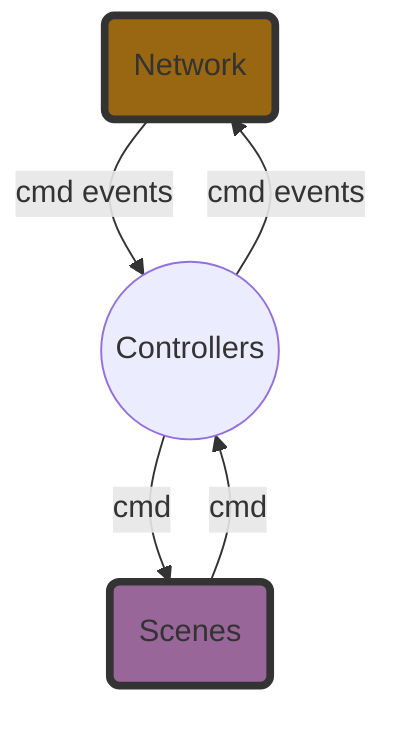

# Overview

go-holdem is a multi-player (p2p network) Hold'em poker game run in a terminal.

## Architecture

```mermaid
graph TB
    Network(Network) -- cmd events --> Controller((Controllers))
    Controller -- cmd --> Scene(Scenes)
    Scene -- cmd --> Controller
    Controller --cmd events --> Network

    style Network fill:#961,stroke:#333,stroke-width:4px
    style Scene fill:#969,stroke:#333,stroke-width:4px
```
